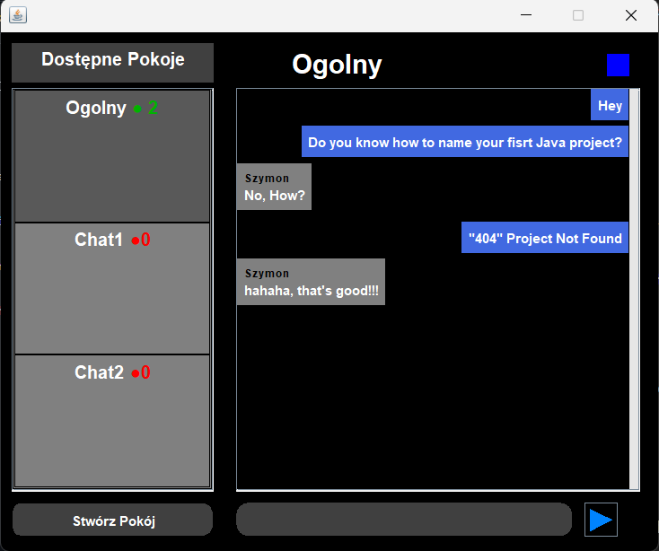

# ChatRoom App
ChatRoom App is an internet communicator application written in Java. It allows users to exchange text messages between rooms, called chatrooms.

## Features:

- **Real-time Communication**: Users can send and receive messages in real-time, enabling instant communication with other users.
  
- **Multiple Chatrooms**: The app supports the creation and joining of multiple chatrooms, allowing users to engage in conversations on different topics or with different groups of people.

- **User-Friendly Interface**: The application provides a user-friendly interface, making it easy for users to navigate between chatrooms, send messages, and manage their conversations.
   
-  **Creating New Chatrooms**: In addition to joining existing chatrooms, users have the ability to create new ones. This feature enables users to initiate conversations on specific topics

# Indroduction

The application consists of two sections:
- **Channel section**: On the left side, there is a section where the list of available clients is displayed along with the number of currently available users within a given room. Thanks to this section, it is possible to switch between available rooms by clicking on the room name to which we want to join. At the bottom, there is a button with which you can create new rooms.
-  **Messages section**: On the right side, there is a section dedicated to exchanging messages between users currently present in the respective room. The chat field displays messages from other users along with the sender's signature. At the bottom, there is a text input field and a button used for sending messages.

# How it works
The application mainly relies on server architecture, which includes functionalities such as:
- **Handling text messages**: The server is responsible for communication between clients. When a client connects to the server, it initiates its own thread. Through this thread, a message sent by the client passes through the server, which identifies the client and the room it is currently in, then broadcasts the message to all clients present in that room.
- **Room Management**: The server handles room management, maintaining a list of available rooms and a roster of currently connected clients. Rooms include a list of clients currently present within them. When a client switches rooms, it sends a special message to the server containing information about the client's current room and the destination room. Based on this message, the server executes the room change.
- **Message History**: Each room has its own message history, which is stored in a list of messages. Each message is stored using a specific format that includes the content of the message and the nickname of the client who sent it.

# Requirements
- **Java 21**: Make sure you have Java Development Kit (JDK) version 21 installed on your system. You can download and install it from the official Java website: [Java SE Downloads](https://www.oracle.com/java/technologies/javase-jdk11-downloads.html).
- **IDE**: Install your favorite Integrated Development Environment (IDE) to be able to run the application.
# How to run
- **Clone the repository**
- **Run the Server class**
- **Run the ChatApp class**
